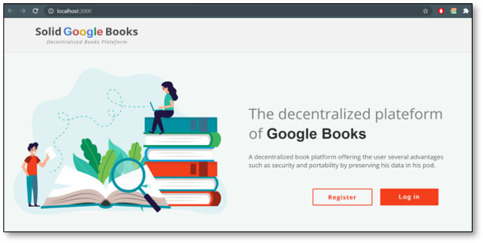
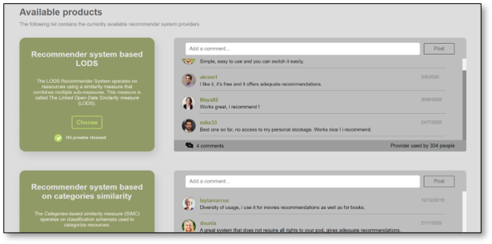

# Solid Google Books
**Solid Google Books**, a decentralized plateform for book recommendations. (Linked repositories in the ***Projects*** section)

## Motivation
The decentralized plateform **Solid Google Books** (SGB) was created in order to provide book recommendations to the users. 

It uses a new technology called [Solid](https://solidproject.org/) which is an exciting new project led by Prof. Tim Berners-Lee, inventor of the World Wide Web, taking place at MIT. The project aims to radically change the way Web applications work today, resulting in true data ownership as well as improved privacy. 

The **SGB** plateform was based on the Solid technology to give the user the choice of which data or how much data he would like to share with the application, and also to offer him a safe storage space called [POD](https://solid.community/), where he can store his personal information and control it. 

## Screenshots

Here are some screenshots. 

<table>
  <tr>
    <td>
        <b>Connexion interface</b>
        <p><sub>Where the user can login to the application</sub></p>
    </td>
    <td>
        <b>Personal information interface page</b>
        <p><sub>Where the user introduces his informations to create an account</sub></p>
    </td>
  </tr>
  <tr>
    <td></td>
    <td></td>
  </tr>
  <tr>
    <td>
        <b>Genres interface</b>
        <p><sub>Where the user can select some of his favorite book genres</sub></p>
    </td>
    <td>
        <b>Book ratings interface</b>
        <p><sub>Where the user can rate some books based on his liking</sub></p>
    </td>
  </tr>
  <tr>
    <td></td>
    <td></td>
  </tr>
  <tr>
    <td>
        <b>Recommendations interface</b>
        <p><sub>Where the book recommendations are shown to the user</sub></p>
    </td>
    <td>
        <b>Recommender Systems Marketplace interface</b>
        <p><sub>Where the user can choose a RS provider to subscibe to</sub></p>
    </td>
  </tr>
  <tr>
    <td></td>
    <td></td>
  </tr>
 </table>
 
## Installation

## Installation

To use the application, you should install the following tools and packages via the terminal of your code editor ( Ex. [Visual Studio Code](https://code.visualstudio.com/download).
Since all necessary packages are present in the ***package.json*** file, you can run :

```bash
npm install
```
Or re-install everything, one package at a time or more (use spacing between package names in the command) :

```bash
npm install <tool_or_library_name>
```

or use the **yarn** command :

```bash
yarn install <tool_or_library_name>
```

#### Application Frontend
  - [ReactJs](https://fr.reactjs.org/)
  
#### Application Backend
  - [Node.js](https://nodejs.org/en/)
  - [Express.js](https://expressjs.com/fr/)
  
#### Solid Libraries
  - [Solid Auth Client](https://github.com/solid/solid-auth-client)
  - [ACL Check](https://github.com/solid/acl-check)
  - [rdflib.js](https://github.com/linkeddata/rdflib.js/)
  - [Solid File Client](https://github.com/jeff-zucker/solid-file-client)
  - [Solid React Components](https://github.com/solid/react-components)
  
#### Additional libraries

  - React's **node-modules**, which can be installed as follows : 
  
```bash
npm install
```
or : 
```bash
yarn install
```
  - [react-toastify](https://www.npmjs.com/package/react-toastify)
  - [react-stepper-horizontal](https://www.npmjs.com/package/react-stepper-horizontal)
  - [react-tooltip](https://www.npmjs.com/package/react-tooltip)
  - [react-icons/fa](https://react-icons.github.io/react-icons/)
  - [react-flippy](https://www.npmjs.com/package/react-flippy)
  - [infinite-react-carousel](https://www.npmjs.com/package/infinite-react-carousel)
  - [react-router-dom](https://reactrouter.com/web/guides/quick-start)
  - [@trendmicro/react-sidenav](https://www.npmjs.com/package/@trendmicro/react-sidenav)
 
   
## API / Datasets references

For this project, we used a well known and a simple API which is the [GoogleBooks API](https://developers.google.com/books/docs/v1/getting_started) (since it's free, it requires a new API key after a certain number of uses), in addition to the [DBpedia Dataset](https://wiki.dbpedia.org/).

## Features

**Solid Google Books** offers mainly the following functionnalities : 

- Profile management (add, delete or modify profile information).
- The possibility to save favorite books in the Solid POD.
- The possibility to rate favorite books in the Solid POD.
- The possibility to search for specific books by introducing a keyword.
- Offering recommendations that suits the user's preferences and profile.
- Including a **Recommender Systems Marketplace** to choose a recommender system provider.

## Application usage

Once you access to the application's interface, there's a whole tab titled **About** in the navigation menu regarding how to use the interface (including images).

## Credits
  [Özcan Seker](https://github.com/ozcanseker/Social-linked-beer)
  
## Developers contact
  - [Rania Benchouiekh](https://github.com/RaniaBenchouiekh)
  - [Mohamed Merzouk](https://github.com/Mohamed-MERZOUK)
